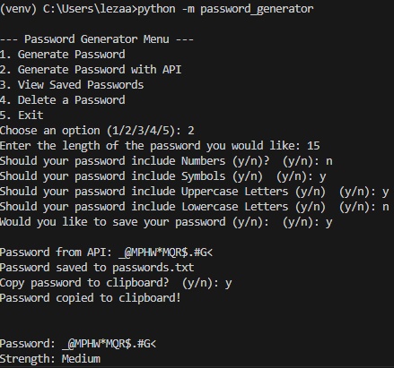

# Password Generator (MVC + API)

A Python password generator application using the MVC (Model-View-Controller) pattern. 
Features include generating passwords locally, fetching passwords from an external API, saving passwords, copying to clipboard, and checking password strength.

## Features
 - Generate passwords locally with letters, numbers, and symbols.
 - Fetch strong passwords from the PasswordWolf API.
 - Check password strength (Weak, Medium, Strong).
 - Save passwords to a local file.
 - Copy passwords to clipboard.
 - Delete saved passwords.
 - MVC architecture for clean and scalable code.

## How to run
1. Clone the repository: https://github.com/Lazaanlouw/Password-Generator

2. Navigate into the project folder: `cd Password-Generator`.

3. (Optional) Create a virtual environment: `python -m venv venv`
`source venv/Scripts/activate # Windows`.

4. Install dependencies: `pip install -r requirements.txt`.

5. Run the project: `python -m password_generator`.

## NOTES: password.txt is ignored for security

## API Integration

This project demonstrates REST API integration. The "Generate Password with API" option fetches a password from the PasswordWolf API, allowing for customized options:

- Length of password
- Include numbers, symbols, uppercase, and lowercase letters
- Save and copy password after fetching

This shows ability to interact with external services and process JSON responses in Python.

## API Fetching Screenshot

Here’s an example of fetching a password from the API:

